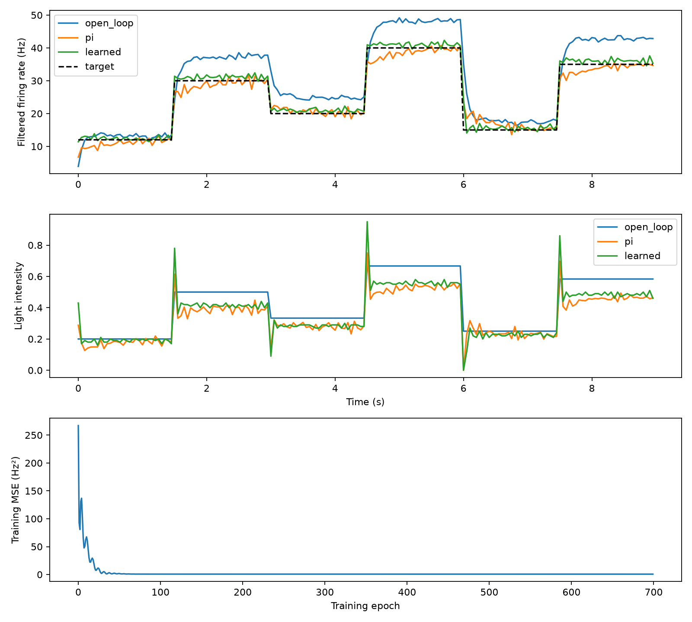

# NeuroLight-AI

Synthetic study of learned one-step predictive control of a 64-neuron LIF population under hidden plant-sensitivity shifts, compared with fixed PI feedback and an information-matched linear ARX baseline. **Synthetic only — not experimental neuroscience, not a ChR2 model, not reinforcement learning.**

**Current results:** `results_v3/`, `results_v4/` and the manuscript `manuscript/NeuroLight_AI_Manuscript_v4.pdf` (source and arXiv package in `manuscript/arxiv/`; every number and figure is generated from the frozen results by `build_tex.py` and `make_figures.py`). **Plan:** `ROADMAP.md`.

## Study map

| Stage | Script | Status | Plant seeds |
|---|---|---|---|
| v0.1 nominal proof of concept | `experiment.py` | exploratory | 0–29 |
| v0.2 frozen-model robustness | `v02_robustness.py` | exploratory | — |
| v0.3 domain randomisation | `v03_domain_randomization.py` | exploratory | — |
| v0.4 history-conditioned H4 | `neurolight_v04_history_adaptive.py` | exploratory (delay results invalid: off-by-one) | 1000–1049 (spent) |
| v0.5 history length / shuffle | `v05_history_ablation.py` | development | — |
| v0.6 mechanistic ablation | `v06_mechanistic_ablation.py` | development | 1400–1649 |
| Locked confirmation (H4 vs PI, joint shuffle) | `confirmation.py` + `CONFIRMATION_PROTOCOL_LOCKED_2026-10-06.json` | **confirmatory** | 3000–3049 (spent) |
| Experiment A: DR-H4 vs matched DR-memoryless | `experiment_a.py` + `EXPERIMENT_A_PROTOCOL_LOCKED_2026-10-07.json` | **confirmatory** | 4000–4049 (spent) |
| Experiment B development (ARX/RLS, adaptive PI) | `experiment_b_dev*.py` | development | 5000–5149 |
| Experiment B final: PI vs ARX-10+RLS vs DR-H4 | `experiment_b_final.py` + `EXPERIMENT_B_FINAL_PROTOCOL.json` | **confirmatory** | 6000–6049 (spent) |
| Post-hoc Experiment B telemetry | `diagnose_experiment_b.py` | exploratory | — |
| Phase-2 development (PI search, adaptive RLS, retraining, rehearsal) | `prospective_dev/` | development | 5000–5149 |
| **v3 prospective confirmation** | `confirmation_v3.py` + `PROTOCOL_V3.json` (FROZEN) + `MANIFEST_V3.json` | **confirmatory** | 7000–7049 (spent) |
| Phase-4 development (gain mechanism, checkpoints, interventions I1–I3) | `prospective_dev4/` | development | 5200–5299 |
| **v4 prospective confirmation** | `confirmation_v4.py` + `PROTOCOL_V4.json` (FROZEN) + `MANIFEST_V4.json` | **confirmatory** | 8000–8049 (spent) |

Training/validation plants for the confirmatory H4 models: 2000–2099 / 2100–2129. Frozen artefacts (scripts, protocols, weights, results) are under `archived_results/`. SHA-256 hashes of the five DR-H4 weight files are recorded in `archived_results/EXPERIMENT_B_FINAL_2026-10-08/experiment_b_final_audit.json`.

**Spent seed sets must not be re-used for tuning.** `archived_results/EXPERIMENT_A_FINAL_2026-10-07/CORRECTION_NOTE.txt` documents an aborted first Experiment-A launch (argument-order bug, corrected before any result was inspected).

---

## v0.1 baseline (original README)


A runnable CPU experiment connecting a synthetic light-responsive neural population to machine learning and feedback control. Built for Mahesh Reddy Pagadala.

## Run

Python 3.10+ (Windows, Linux or macOS):

```sh
python -m venv .venv
# Windows: .venv\Scripts\activate
# Linux/macOS: source .venv/bin/activate
python -m pip install -r requirements.txt
python experiment.py --out results
python -m unittest -v
```

The bundled results were generated by this command. No GPU, API keys, services, or external datasets are needed. Results may vary slightly across numerical library versions.

## How the experiment works

1. A population of 64 heterogeneous leaky integrate-and-fire neurons receives stimulation. Light intensity opens a simplified first-order gate, adding depolarising current. Neurons integrate current, cross a threshold, spike, reset and enter a refractory period.
2. The simulator produces firing rate observations every 50 ms, smoothed with an exponential filter. Random stimulation blocks provide training data.
3. A 3-input, 32-hidden-unit tanh MLP learns next-step rate from current rate, previous intensity and proposed intensity. Explicit NumPy backpropagation and Adam train it for 700 epochs. Twenty independent circuit seeds train the model; five distinct seeds validate and five test it. Splits are by whole trajectory, not overlapping rows. Features/rates use a fixed 60 Hz scale, not statistics fitted to held-out data.
4. A learned one-step predictive controller evaluates 101 candidate intensities and minimises predicted tracking error plus intensity and intensity-change penalties. It observes actual rate after each action and replans. It is not an RL agent or a multi-step MPC implementation.
5. Open-loop and PI controllers provide comparisons. Ten unseen circuit seeds track six target levels at nominal and doubled voltage noise. Target schedules are separate from the random training stimuli.

## Recorded results

Held-out next-step prediction RMSE: MLP **0.802 Hz**, linear regression **0.934 Hz**, persistence **7.899 Hz**.

| Controller | Nominal tracking RMSE (Hz) | Doubled-noise RMSE (Hz) | Nominal mean intensity |
|---|---:|---:|---:|
| Open-loop | 4.783 | 6.199 | 0.422 |
| PI | 2.017 | 2.361 | 0.367 |
| Learned | 0.967 | 1.944 | 0.376 |

Values are averages across ten circuits, including target transitions. Standard deviations are in `results/metrics.json`. The learned controller improves tracking in this benchmark, but uses slightly more average light than PI. These baselines use fixed illustrative settings; no exhaustive tuning or statistical superiority claim is made.



## Files

- `experiment.py`: simulator, data generation, MLP training and controller evaluation.
- `test_experiment.py`: determinism, light-response, learning and action-bound checks.
- `results/dataset.npz`: explicit train/validation/test inputs and targets. Input columns: filtered rate / 60, previous intensity, proposed intensity; target: next filtered rate / 60.
- `results/predictor.npz`: trained NumPy weights (`w1`, `b1`, `w2`, `b2`).
- `results/metrics.json` and `results/results.png`: measured results and plot.

To load the predictor:

```python
import numpy as np
from experiment import Predictor
m = Predictor()
with np.load('results/predictor.npz') as weights:
    for name in ('w1', 'b1', 'w2', 'b2'):
        setattr(m, name, weights[name].copy())
predicted_hz = m.predict(np.array([[20/60, 0.3, 0.5]]))*60
print(predicted_hz)
```

## Scientific scope and next steps

This is a synthetic educational research prototype, not a validated biological model. Its gate is phenomenological: it does not implement channelrhodopsin-specific kinetics, desensitisation, optical scattering, gene expression, inhibitory opsins or recurrent synapses. All neurons receive one common stimulus; it controls population rate, not arbitrary individual spike patterns. Intensity is dimensionless and noise is in model voltage units.

No Nobel claim or recipient attribution is included. Biological provenance and primary-paper citations should be established before scientific publication. Next useful work: tune baselines on a separate development set, test parameter and sensor shifts, add partial observations and delays, then introduce validated channel kinetics or a Brian2 implementation. Sequence modelling and reinforcement learning are later extensions, not implemented features.
